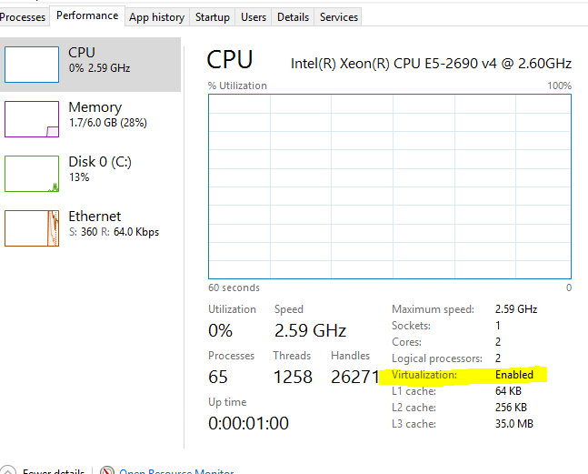
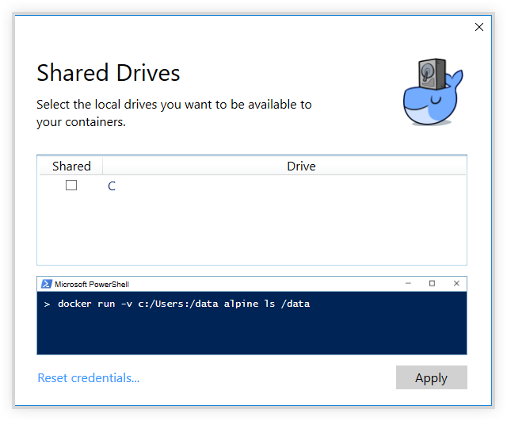
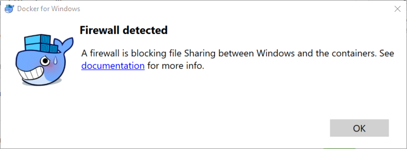

# Windows 머신에서 도커 개발 환경 사용하기

이하는 공식 문서의 내용을 발췌한 것입니다.

## 1. 시스템 요구사항 확인

Windows 머신에서 도커를 사용하려면 다음 요구사항을 충족해야 합니다.

-   64bit Windows 10 Pro, Enterprise and Education (Build 10586 or later)
-   가상화
-   Microsoft Hyper-V

### 1.1. 가상화

작업관리자에서 `가상화:사용`으로 설정되어 있는 지 확인합니다.

### 1.2. Hyper-v

 -  <kbd>제어판</kbd> > <kbd>프로그램</kbd> > <kbd>프로그램 및 기능</kbd>을 엽니다.
 -  좌측에 <kbd>Windows 기능 켜기/끄기</kbd> 버튼을 클릭합니다.
 -  Hyper-v 항목을 찾아서 활성화한 후 <kbd>확인</kbd>을 눌러 창을 닫고 컴퓨터를 재부팅합니다.

## 2. 공유 설정

우리의 개발 환경은 호스트 컴퓨터(Windows)의 폴더를 도커 컴퓨터(Linux)에 마운트합니다. Windows 쪽에서 공유 설정을 해 줘야 합니다.

-   알림바에서 도커 아이콘에서 마우스 오른쪽 버튼을 클릭하여 <kbd>설정</kbd>으로 진입합니다.
-   <kbd>공유</kbd> 메뉴를 눌러, 공유할 드라이브에 체크합니다. 예제 프로젝트가 `C:\` 드라이브에 있다면 [v] `C` 를 선택합니다.

## 3. 방화벽 설정

윈도우 방화벽에서 `10.0.75.1` IP의 `445`번 포트에 대해 In/Outbound를 전부 허용해 줍니다.
 

